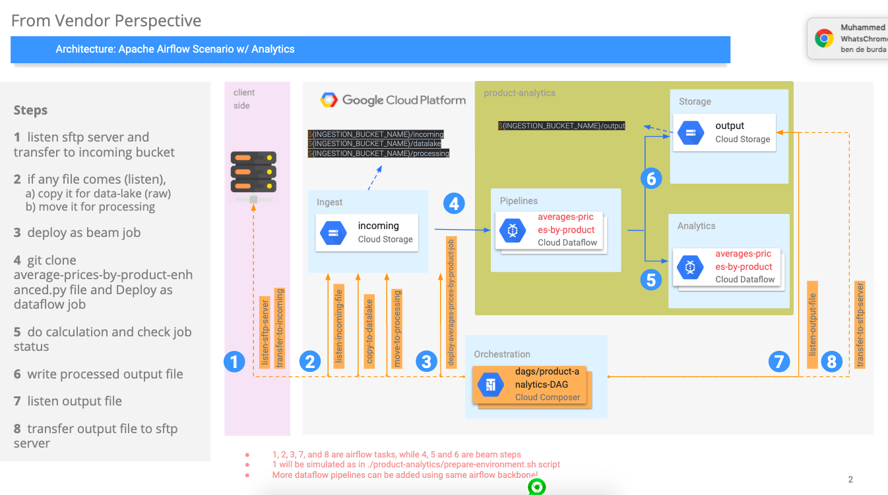

# airflow-sandbox
It is easy to create apache airflow DAGs, but it is really hard to create meaningful architectures w/ Airflow.

1. airflow-sandbox :  meaningful scenario w/ GCP Cloud Composer
2. airflow-sandbox/core : fundamentals of airflow

## How To Start

1. Create environment w/ 
   - `conda create -n airflow-sandbox python=3.7 anaconda`
   - `conda activate airflow-sandbox`

2. Install airflow packages 
   - `pip install  apache-airflow[async,crypto,jdbc,gcp_api,google_auth]`

3. Start airflow on your local 
   - `airflow initdb`
   - `ls ~/airflow`
   - `mkdir ~/airflow/dags`
   - `airflow webserver -p 8080`
   - `airflow scheduler`
   - Open `localhost:8080` in your web browser
4. Copy dag files into dags folder like `cp basic-dag.py ~/airflow/dags`
5. To test the dag
   - `airflow list_dags`
   - `airflow list_tasks my_first_dag_v2`
   - `airflow test my_first_dag_v2 print_hello 2019-05-22`

## High Level Architecture - /product-analytics
   
